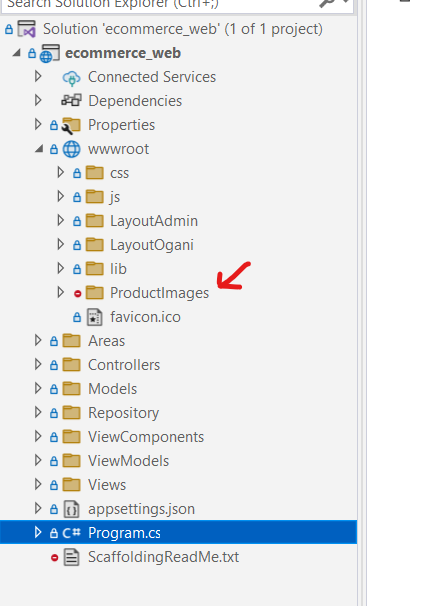
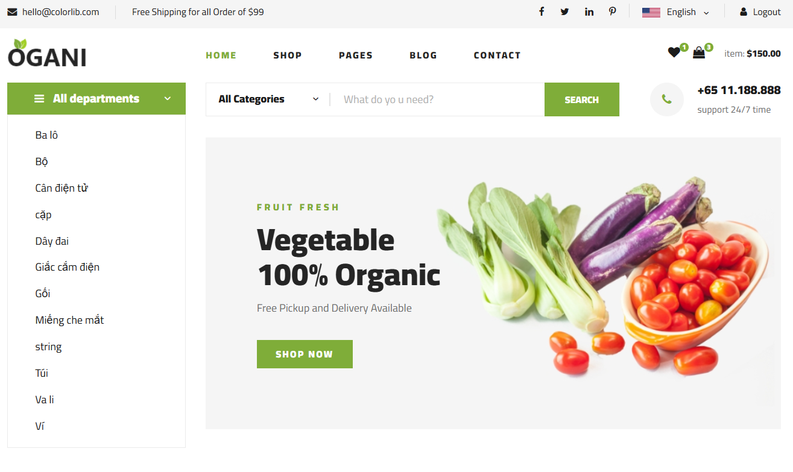
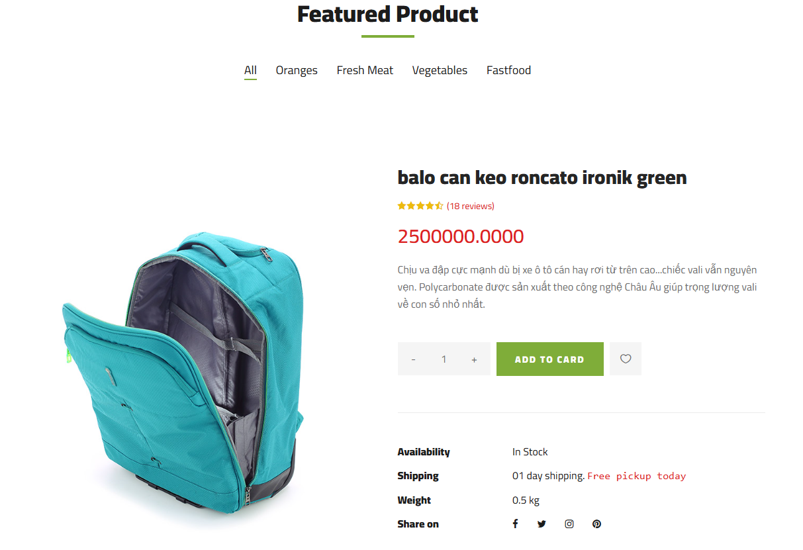
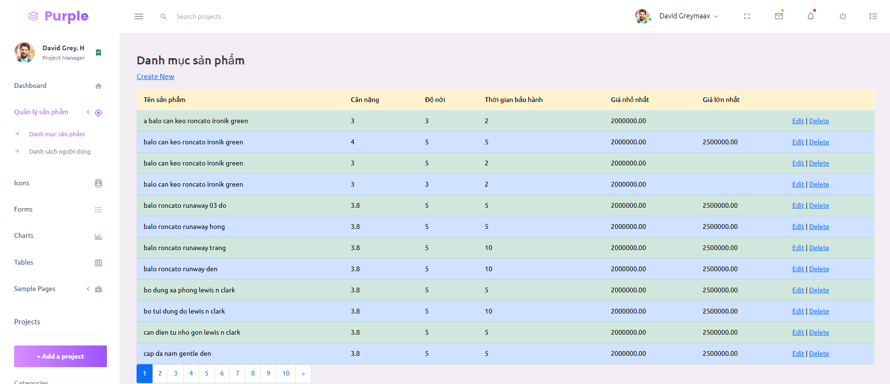
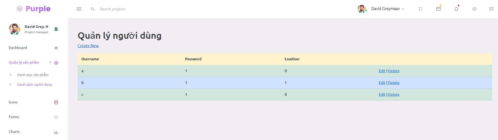

# Thi Thuc Hanh SE310.P11

Link Hình ảnh sản phẩm: https://drive.google.com/file/d/1bFD3kwaxgxsV7oiPAxmG1vX52dUY-u4A/view

## 1. Dowload source code

- Clone project về máy bằng lệnh:

```sh
git clone
```

## 2. Dowload hinh anh product:

- Dowload hình ảnh sản phẩm tại link: https://drive.google.com/file/d/1bFD3kwaxgxsV7oiPAxmG1vX52dUY-u4A/view

## 3. Thêm hình ảnh vào project



## 4. Init Database

Link Database: https://drive.google.com/file/d/1LVD7fIs5ao9DT_29lIS9mB3ksUmEgpZ6/view

- Mở SQL Server Management Studio

## 5. Change ConnectionString

- Download library:

```sh
 Microsoft.EntityFrameworkCore.Tools, Microsoft.EntityFrameworkCore.SqlServer, Microsoft.EntityFrameworkCore
```

- Mở Package Manager Console

```sh
Scaffold-DbContext "Your ConnectionString" Microsoft.EntityFrameworkCore.SqlServer -OutputDir Models
```

## 6. Chạy project

- Client: https://localhost:5050
- Admin: https://localhost:5050/admin

## 7. Tài khoản

- username: a
- password: 1

## 8. Image demo







